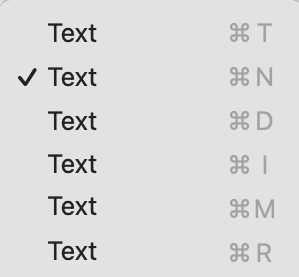

# EverythingIsText
"Utter Garbage!" MrWatson-de

In FileMaker Everything is Text - Nooooooot!

See the example file.

And get the MBS plugin.

It does wonderful things, like telling you the data type of anything you pass it.
